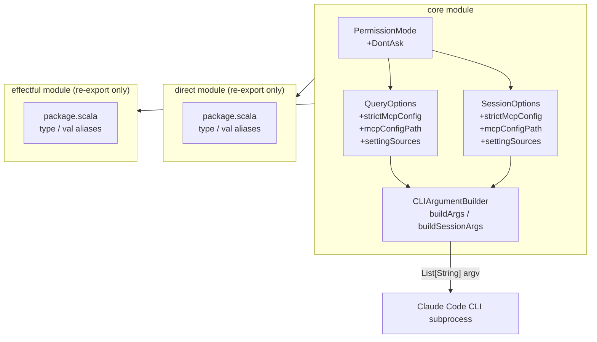
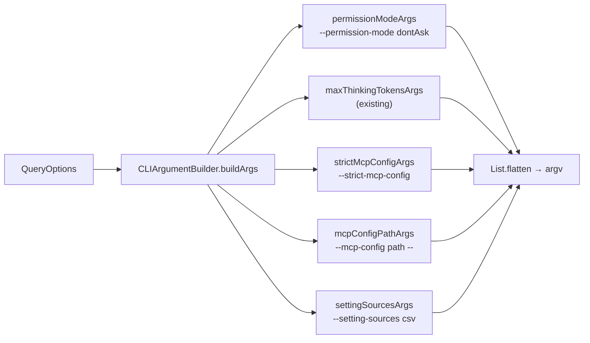

# Review Packet: CC-46 — Option-C Tool-Isolation Knobs

## Goals

Consumer `iterative-works/procedures` (PROC-401) needs to spawn event-processor subprocesses
with a hard tool allow-list that cannot be widened by inherited `.mcp.json` files, user-level
settings, or interactive permission prompts. Without dedicated CLI flags for those controls, an
isolated subprocess can either silently inherit the user's MCP configuration or hang waiting on
an interactive permission prompt for a tool not in `allowedTools`.

This change extends the SDK's `QueryOptions`, `SessionOptions`, and `PermissionMode` types with
four new "Option-C isolation" knobs:

| SDK field / method | CLI flag emitted | Purpose |
|---|---|---|
| `strictMcpConfig = Some(true)` | `--strict-mcp-config` | Prevent merging of any `.mcp.json` other than the explicitly provided one |
| `mcpConfigPath = Some(path)` | `--mcp-config <path> --` | Explicitly point at a specific `.mcp.json` (trailing `--` terminates the variadic flag) |
| `settingSources = List(...)` | `--setting-sources <csv>` | Restrict settings resolution (e.g. `project` excludes user/managed) |
| `PermissionMode.DontAsk` | `--permission-mode dontAsk` | Enforce `allowedTools` as a hard allow-list; no prompts, no hangs |

Key objectives:
- All four knobs default to emitting zero argv tokens, preserving byte-identical behaviour for
  existing callers.
- The `direct` and `effectful` modules pick up the additions automatically via their existing
  `type`/`val` re-exports — no source edits required there.
- The change is additive only: no existing `PermissionMode` cases are deprecated or renamed.

## Scenarios

- [ ] `PermissionMode.DontAsk` enum case exists and serialises to the CLI string `"dontAsk"` in
      both `buildArgs` and `buildSessionArgs`.
- [ ] `QueryOptions` exposes `strictMcpConfig: Option[Boolean] = None`,
      `mcpConfigPath: Option[String] = None`, `settingSources: List[String] = Nil` with
      matching `withStrictMcpConfig`, `withMcpConfigPath`, `withSettingSources` fluent helpers.
- [ ] `SessionOptions` exposes the same three fields and fluent helpers with symmetric signatures.
- [ ] `QueryOptions.simple` factory is updated to enumerate the three new fields as named
      arguments, keeping the factory exhaustive.
- [ ] `strictMcpConfig = Some(true)` emits `--strict-mcp-config`; `Some(false)` and `None` emit
      nothing (no `--no-strict-mcp-config` flag exists in the CLI).
- [ ] `mcpConfigPath = Some(path)` emits the three-element slice `["--mcp-config", path, "--"]`
      in both builders. The `"--"` terminator is mandatory because `--mcp-config` is variadic.
- [ ] `mcpConfigPath = None` emits neither `--mcp-config` nor a stray `"--"`.
- [ ] `settingSources` non-empty emits `--setting-sources <csv>` with values joined by commas;
      empty list emits nothing.
- [ ] Argv ordering is locked: `--permission-mode` precedes the isolation trio; within that trio,
      `--strict-mcp-config` → `--mcp-config <path> --` → `--setting-sources <csv>`.
- [ ] For `buildSessionArgs`, the required streaming preamble
      `["--print", "--input-format", "stream-json", "--output-format", "stream-json"]` still
      occupies positions 0–4 when all four isolation knobs are set.
- [ ] `./mill __.compile` succeeds with no non-exhaustive `PermissionMode` match warnings.
- [ ] `./mill __.test` is green with all 19 new tests passing alongside pre-existing tests.
- [ ] `./mill direct.compile` and `./mill effectful.compile` succeed without source edits in
      those modules.

## Entry Points

| File | Method / Class | Why Start Here |
|---|---|---|
| `core/src/works/iterative/claude/core/model/PermissionMode.scala` | `enum PermissionMode` | Smallest change; see the new `DontAsk` case and understand the serialisation contract |
| `core/src/works/iterative/claude/core/model/QueryOptions.scala` | `case class QueryOptions` | New fields and fluent helpers; also see updated `permissionMode` Scaladoc and exhaustive `simple` factory |
| `core/src/works/iterative/claude/core/model/SessionOptions.scala` | `case class SessionOptions` | Symmetric additions to `QueryOptions`; confirm field names, types, and helpers match |
| `core/src/works/iterative/claude/core/cli/CLIArgumentBuilder.scala` | `buildArgs`, `buildSessionArgs` | Core translation logic; verify new `val` blocks and their position in the final `List(...).flatten` |
| `core/test/src/works/iterative/claude/core/cli/CLIArgumentBuilderTest.scala` | tests 14–22 (new) | Presence / absence / `Some(false)` / CSV join / terminator / ordering tests for `QueryOptions` path |
| `core/test/src/works/iterative/claude/core/cli/SessionOptionsArgsTest.scala` | tests 16–26 (new) | Symmetric coverage for `SessionOptions` path plus required-flags preamble regression |

## Diagrams

### Component Overview



### Argv Construction Flow (buildArgs)



### The `--mcp-config` Variadic Terminator

```
Without terminator:   claude ... --mcp-config ./.mcp.json  "tell me a joke"
                                              ^^^^^^^^^^^^  ^^^^^^^^^^^^^^^
                                              path arg      consumed as 2nd config path!

With terminator:      claude ... --mcp-config ./.mcp.json  --  "tell me a joke"
                                              ^^^^^^^^^^^^  ^^  ^^^^^^^^^^^^^^^
                                              path arg      end  safe prompt arg
```

## Test Summary

All tests are unit tests. No integration or E2E tests are needed — the change is pure argv
construction with no effects or external process calls.

### CLIArgumentBuilderTest.scala — new tests (9 added)

| # | Test name | Type | Verifies |
|---|---|---|---|
| 1 | `PermissionMode.DontAsk maps to --permission-mode dontAsk` | Unit | Serialisation string is `"dontAsk"` (camelCase) |
| 2 | `strictMcpConfig = Some(true) emits --strict-mcp-config` | Unit | Presence when set |
| 3 | `strictMcpConfig default (None) does not emit --strict-mcp-config` | Unit | Absence when default |
| 4 | `strictMcpConfig = Some(false) does not emit --strict-mcp-config` | Unit | No negation flag emitted |
| 5 | `mcpConfigPath maps to --mcp-config <path> --` | Unit | Three-element slice including `"--"` terminator |
| 6 | `mcpConfigPath default (None) does not emit --mcp-config` | Unit | Neither flag nor stray terminator |
| 7 | `settingSources non-empty maps to --setting-sources with CSV value` | Unit | CSV join via `containsSlice` |
| 8 | `settingSources default (Nil) does not emit --setting-sources` | Unit | Absence when empty |
| 9 | `all four Option-C isolation flags round-trip in deterministic order` | Unit | All four flags present; ordering `permission-mode < strict < mcp-config < setting-sources` |

### SessionOptionsArgsTest.scala — new tests (10 added)

| # | Test name | Type | Verifies |
|---|---|---|---|
| 1 | `PermissionMode.DontAsk maps to --permission-mode dontAsk` | Unit | Same as QueryOptions counterpart |
| 2 | `strictMcpConfig = Some(true) emits --strict-mcp-config` | Unit | Presence when set |
| 3 | `strictMcpConfig default (None) does not emit --strict-mcp-config` | Unit | Absence when default |
| 4 | `strictMcpConfig = Some(false) does not emit --strict-mcp-config` | Unit | No negation flag emitted |
| 5 | `mcpConfigPath maps to --mcp-config <path> --` | Unit | Three-element slice including terminator |
| 6 | `mcpConfigPath default (None) does not emit --mcp-config` | Unit | Absence when default |
| 7 | `settingSources non-empty maps to --setting-sources with CSV value` | Unit | CSV join via `containsSlice` |
| 8 | `settingSources default (Nil) does not emit --setting-sources` | Unit | Absence when empty |
| 9 | `all four Option-C isolation flags round-trip in deterministic order` | Unit | Same ordering assertions as QueryOptions smoke test |
| 10 | `required session flags still appear at the start of the argument list when all four new flags are set` | Unit | `args.take(5) == requiredFlags` — preamble not displaced by tail-append |

**Pre-existing tests:** All pass unchanged (confirmed in implementation log; no pre-existing
assertions were modified).

## Files Changed

13 files changed vs `main` (1,358 insertions, 5 deletions). Production source changes are
confined entirely to the `core` module.

### Production source (4 files)

<details>
<summary>core/src/works/iterative/claude/core/model/PermissionMode.scala (+3 lines)</summary>

Added `DontAsk` enum case with per-case Scaladoc. The other three cases remain undocumented
(pre-existing asymmetry; intentional per phase context scope).

</details>

<details>
<summary>core/src/works/iterative/claude/core/model/QueryOptions.scala (+31 lines)</summary>

- Three new fields: `strictMcpConfig: Option[Boolean] = None`, `mcpConfigPath: Option[String] = None`, `settingSources: List[String] = Nil`, each with Scaladoc describing the CLI flag.
- Three fluent helpers: `withStrictMcpConfig`, `withMcpConfigPath`, `withSettingSources`.
- `QueryOptions.simple` factory updated to pass all three as named arguments.
- `permissionMode` field Scaladoc updated to include `DontAsk` bullet.

</details>

<details>
<summary>core/src/works/iterative/claude/core/model/SessionOptions.scala (+24 lines)</summary>

Symmetric additions to `QueryOptions`: same three fields, same Scaladoc, same three fluent
helpers. `object SessionOptions.defaults` unchanged (picks up new field defaults automatically
via the zero-argument constructor).

</details>

<details>
<summary>core/src/works/iterative/claude/core/cli/CLIArgumentBuilder.scala (+40 lines)</summary>

Both `buildArgs` and `buildSessionArgs` receive identical additions:
1. `case Some(PermissionMode.DontAsk) => List("--permission-mode", "dontAsk")` in the existing `permissionModeArgs` match.
2. `val strictMcpConfigArgs` — emits `List("--strict-mcp-config")` for `Some(true)`, `List.empty` otherwise.
3. `val mcpConfigPathArgs` — emits `List("--mcp-config", path, "--")` for `Some(path)`, `List.empty` otherwise.
4. `val settingSourcesArgs` — emits `List("--setting-sources", csv)` when non-empty, `List.empty` otherwise.

All three new `val` blocks are tail-appended in the `List(...).flatten` after `maxThinkingTokensArgs`, in order `strict → mcp-config → setting-sources`.

</details>

### Test source (2 files)

<details>
<summary>core/test/src/works/iterative/claude/core/cli/CLIArgumentBuilderTest.scala (+78 lines)</summary>

9 new `test("...")` blocks covering the QueryOptions-side translation. See Test Summary above.

</details>

<details>
<summary>core/test/src/works/iterative/claude/core/cli/SessionOptionsArgsTest.scala (+83 lines)</summary>

10 new `test("...")` blocks covering the SessionOptions-side translation and the required-flags
preamble regression. See Test Summary above.

</details>

### Project management (7 files, no production impact)

`project-management/issues/CC-46/` — analysis, tasks, phase context, phase tasks, implementation
log, phase review, and review state. These document the decision trail and are not part of the
published artifact.
